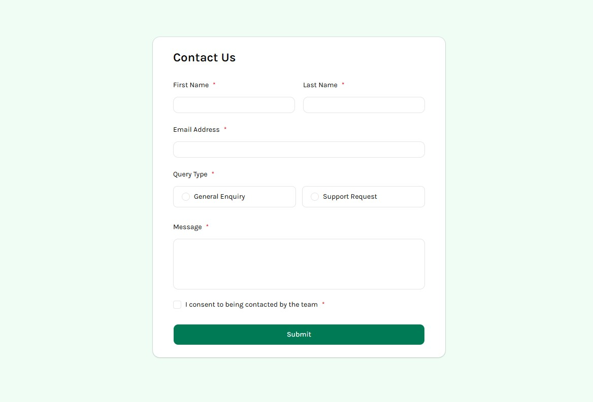

# Frontend Mentor - Contact form solution

This is a solution to the [Contact form challenge on Frontend Mentor](https://www.frontendmentor.io/challenges/contact-form--G-hYlqKJj). Frontend Mentor challenges help you improve your coding skills by building realistic projects. 

## Table of contents

- [Overview](#overview)
  - [The challenge](#the-challenge)
  - [Screenshot](#screenshot)
  - [Links](#links)
- [My process](#my-process)
  - [Built with](#built-with)
  - [What I learned](#what-i-learned)
  - [AI Collaboration](#ai-collaboration)
- [Author](#author)

**Note: Delete this note and update the table of contents based on what sections you keep.**

## Overview

### The challenge

Users should be able to:

- Complete the form and see a success toast message upon successful submission
- Receive form validation messages if:
  - A required field has been missed
  - The email address is not formatted correctly
- Complete the form only using their keyboard
- Have inputs, error messages, and the success message announced on their screen reader
- View the optimal layout for the interface depending on their device's screen size
- See hover and focus states for all interactive elements on the page

### Screenshot

### Links

- Solution URL: [Solution URL here](https://github.com/sirbiel100/Contact-Form)
- Live Site URL: [Live site URL here](https://sirbiel100.github.io/Contact-Form/)

## My process

### Built with

- Semantic HTML5 markup
- Flexbox
- [React](https://reactjs.org/) - JS library
- [Next.js](https://nextjs.org/) - React framework
- [Tailwind CSS](https://tailwindcss.com/) - For styles
- [Typescript](https://www.typescriptlang.org/) - For safe type
- [Shadcn Ui](https://ui.shadcn.com/) - For Components

### What I learned

I learned a lot how to better user Shadcn and its components, it was fun and challenging at the same time! I learned better how to custom their components and validate the inputs.

### AI Collaboration

Describe how you used AI tools (if any) during this project. This helps demonstrate your ability to work effectively with AI assistants.

- What tools did I use -> Claude
- How did I use it -> Learning

## Author

- Website - [Portfolio](https://portfolio-gabrielcrispim.vercel.app/)
- Frontend Mentor - [@sirbiel100](https://www.frontendmentor.io/profile/sirbiel100)
- LinkedIn - [@Gabriel Crispim](https://www.linkedin.com/in/gabrielrcrispim/)
